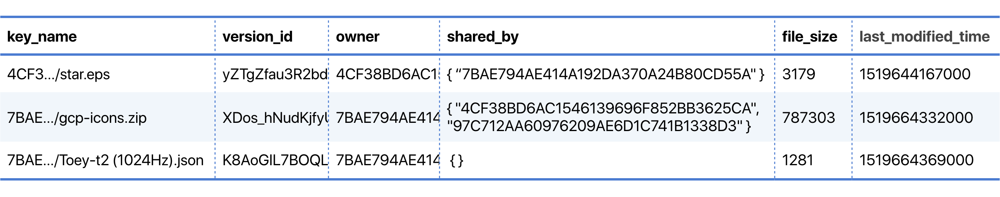

# myDropbox V2

[](https://github.com/RichardLitt/standard-readme)

A command-line client application for storing your personal files on cloud and accessing them anywhere, anytime.

## Table of Contents

- [Quickstart](#quickstart)
	- [Amazon Web Service](#amazon-web-service)
  - [Your Local Machine](#your-local-machine)
- [Design](#design)
  - [File Hierarchy in S3](#file-hierarchy-in-s3)
  - [A User Table in Amazon DynamoDB (myDropboxUsers)](#a-user-table-in-amazon-dynamodb-mydropboxusers)
  - [A File Table in Amazon DynamoDB (myDropboxFiles)](#a-file-table-in-amazon-dynamodb-mydropboxfiles)
- [Project Structure](#project-structure)
- [Application Commands](#application-commands)
- [License](#license)

## Quickstart

### Amazon Web Service

1. Create a table in Amazon DynamoDB named `myDropboxUsers` and set `username` attribute as a primary partition key. An example instance of `myDropboxUsers` table is shown in [A User Table in Amazon DynamoDB (myDropboxUsers)](#a-user-table-in-amazon-dynamodb-mydropboxusers) section below.

2. Create a table in Amazon DynamoDB named `myDropboxFiles` and set `key_name` attribute as a primary partition key. An example instance of `myDropboxFiles` table is shown in [A File Table in Amazon DynamoDB (myDropboxFiles)](#a-file-table-in-amazon-dynamodb-mydropboxfiles) section below.

3. In Amazon S3, create a new bucket for myDropbox's file storage. As a bucket's name has to be globally unique across Amazon Web Service, it cannot be as same as mine. So, name it whatever you want but make sure that a **versioning property** is enabled.

4. Create an IAM User with the following policies:
    - `AmazonS3FullAccess`
    - `AmazonDynamoDBFullAccess`
    
    After creating, you will get a key ID and secret.

5. Create or update your local AWS `credential` file with the key ID and secret you have got from the previous step.
    ```
    [default]
    aws_access_key_id = [AWS_ACCESS_KEY_ID]
    aws_secret_access_key = [AWS_SECRET_ACCESS_KEY]
    ```

### Your Local Machine

1. Clone [this repository](https://github.com/pirsquareff/my-dropbox-v2) if you do not have the source code.
2. Import this project to your preferable Java IDE.
3. In `src/myDropbox_v2_5730329521/Constant.java` (line 4), change a value of `BUCKET_NAME` variable to be your S3 bucket's name.
    ```java
    public final class Constant {
        public static final String BUCKET_NAME = "your-s3-bucket-name"; // TODO: CHANGE THIS
        // ...
    }
    ```
4. Build and run.

## Design

### File Hierarchy in S3
The Amazon S3 data model is a flat structure. There is no hierarchy of subfolders; however, you can infer logical hierarchy using key name prefixes and delimiters as the Amazon S3 console does.

So, to separate user’s files, every object’s key name is prefixed with a UID of the user it belongs to.
This allows users to store their files in the same S3 bucket without collision even two users uploaded files with the same name.


### A User Table in Amazon DynamoDB (myDropboxUsers)


In Amazon DynamoDB aspect, this table consists of 3 attributes: `username` *(String)* as a primary partition key, `password` *(String)*, and `uid` *(String)*.

A user’s UID is generated from his/her username with the MD5 hashing algorithm. However, there is still little chance that two different strings can have exact MD5 hash value. To avoid this collision, we re-generated new hash value from the previous one till it is unique across all users in the database.

For a security’s purpose, a password is encrypted by the salted PBKDF2 hashing algorithm and is kept in the form of `salt$hashedPassword`.

As there is no update, reading this table is eventually consistent.

### A File Table in Amazon DynamoDB (myDropboxFiles)



There are 6 attributes: `key_name` *(String)* as a primary partition key, `version_id` *(String)*, `owner` *(String)*, `shared_by` *(StringSet)*, `file_size` *(Number)*, and `last_modified_time` *(Number)*.

After a file is successfully uploaded to S3, its key name along with metadata are also added to myDropboxFiles table. However, if a file is successfully uploaded to S3, but an addition of the file record to myDropboxFiles table is unsuccessful, a rolling back mechanism is triggered by removing that file in S3 as it has never be uploaded.

When a file is shared with another user, UID of that user is added to the `shared_by` set.

All commands use eventually consistent reads, except `get` command which uses strongly consistent reads to make sure that a user will always receive a file with the latest version.

## Project Structure

This project is composed of 5 classes in total:
1. **Constant** defines constants for the whole project.
2. **FileRecord** is an Amazon DynamoDB mapper class of `myDropboxFiles` table.
3. **User** is an Amazon DynamoDB mapper class of `myDropboxUsers` table.
4. **PasswordManager** provides methods for verifying and hashing user's password.
5. **myDropbox_v2_5730329521** serves as the main class to receive and interpret input commands from a user and invoke the corresponding method.

## Application Commands

| Command | Description |
|---------|----------------------------------------------------------------------------------------------------------------------|
| newuser | Create a new user with specified username and password<br> **Usage**: `newuser <username> <password> <confirm-password>` |
| login | Login to the application<br> **Usage**: `login <username> <password>` |
| logout | Logout from the application<br> **Usage**: `logout` |
| put | Upload a file to myDropbox<br> **Usage**: `put <file-path>` |
| view | Display files owned by the user as well as files that others have shared with the user<br> **Usage**: `view` |
| get | Download a file from myDropbox<br> **Usage**: `get <file-name> [owner-username]` |
| share | Share a file to another user<br> **Usage**: `share <file-name> <username>` |
| quit | Stop using the myDropbox application<br> **Usage**: `quit` |

## License

[MIT](LICENSE) © Parinthorn Saithong